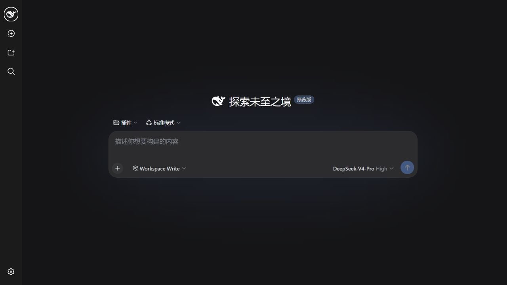
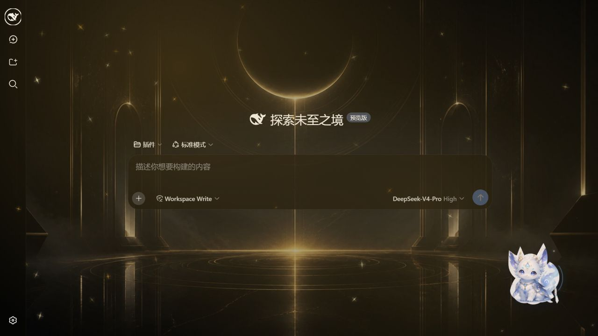

# DeepSeek Harness Desktop Themes

一个可安装、可配置、可卸载的 DeepSeek Harness 桌面外观插件。为长时间编程与对话场景提供现代、克制、内容优先的界面：**六套签名主题与专属壁纸、字体预设、光影与粒子动效、持久化自定义壁纸、毛玻璃、自定义配色主题**。

- 平台：Web（DSH 的浏览器外壳）；宿主进程侧负责配置持久化
- 技术：TypeScript + React（客户端）+ Cordis（DSH 插件运行时）
- 依赖零额外运行时库（仅 `@deepseek-ai/schemastery` 用于宿主侧 schema）

> 本插件只使用 DeepSeek Harness **真实存在的插件接口**（`theme` 服务、`settingsScope`、`slots`、`cordis.patch.yml` 组合层），不修改任何宿主核心文件，卸载即恢复。

---

## 目录

1. [效果对比](#效果对比)
2. [功能](#功能)
3. [快速开始（构建）](#快速开始构建)
4. [让 AI 一键安装](#让-ai-一键安装)
5. [手动安装](#手动安装)
6. [卸载与恢复](#卸载与恢复)
7. [配置与持久化](#配置与持久化)
8. [字体安装与回退](#字体安装与回退)
9. [性能模式](#性能模式)
10. [测试与构建验证](#测试与构建验证)
11. [已知限制](#已知限制)
12. [项目结构](#项目结构)

---

## 效果对比

以下截图来自同一台机器、同一 DSH 新会话页面和相同侧边栏状态；右图为插件的默认组合（黑金星穹、黑曜石月殿壁纸、金色星尘与月灵狐）。点击图片可查看原图。

| 无插件 | 启用插件 |
|---|---|
| [](docs/screenshots/without-plugin.png) | [](docs/screenshots/with-plugin.png) |

---

## 功能

| 分组 | 能力 |
|---|---|
| 主题风格 | 六套差异明显的主题：量子蓝、极光幻境、薄荷清风、樱雾、日落流光、黑金星穹；可视化主题卡片（背景/面板/文字/强调色/粒子缩略）+ 风格标签 |
| 字体排版 | 界面/代码字体独立下拉，预设 8+8 组，每个选项用对应字体渲染预览并显示“已安装/回退”；字号、行高、字重、连字、平滑 |
| 壁纸 | 六套主题各有专属内置壁纸；本地选择 + 拖放 + 最近使用 + 预览；填充/适应/居中/拉伸/平铺；缩放/透明度/模糊/亮度/饱和度/暗色遮罩/主题色混合；自定义壁纸 **IndexedDB 持久化** |
| 桌面小人 | 六款形象（月灵狐、小程序员、阮启岚、幽灵、史莱姆、小猫）；月灵狐为无底图分层轮廓，快速随机眨眼、自然左右摇头、大幅可爱摆尾、观察与抬头；发声提供正常/温柔/欢快/俏皮/沉稳/机器人 6 种语调，并为每个形象保留独立声线；阮启岚独占说话、打篮球、铁山靠、挥手与随机动作；可拖拽定位、单击打开快捷菜单 |
| 光影效果 | 光影强度（关闭/柔和/标准/明亮）、光标跟随柔光、背景视差、柔光呼吸 |
| 粒子效果 | 十种预设（科技数据流、星空、极光、萤火、气泡、樱花、金尘、呼吸…）；密度/数量/大小/速度/透明度/连线/鼠标互动/自动配色 |
| 透明与毛玻璃 | 窗口/侧边栏/面板/输入区透明度（0.55 下限）；模糊强度（关闭/轻度/标准/强烈）+ 降级 |
| 自定义配色 | 七色自定义主题；一键生成 7 种协调配色；对比度检测与一键修正；命名/保存/复制/删除；内置主题不可破坏、可复制后编辑 |
| 动画与性能 | 动画速度（静止/舒缓/标准/活跃）；性能等级（省电/均衡/高质量） |
| 导入导出重置 | JSON 导出/导入（schema 校验 + 版本迁移）；分组/当前主题/全部默认值重置 |

所有设置在“设置 → 桌面外观”页实时预览，并通过宿主设置存储 + IndexedDB 可靠持久化。默认组合为**黑金星穹 + 黑曜石月殿壁纸 + 月灵狐桌宠**；桌宠显示在右下角，可拖拽移动、单击唤出快捷菜单，位置与偏好随配置持久化。

---

## 快速开始（构建）

前置：Node.js ≥ 20（已在 Node 24 验证）、npm。

```bash
cd dsh-desktop-themes
npm install
npm run build        # 生成 lib/index.js 与 lib/client.js
npm run typecheck    # 严格类型检查（无 emit）
npm test             # 98 个单元测试
npm run bench        # 可复现的性能微基准
```

构建产物：

- `lib/index.js` — 宿主入口（注册 `ui-desktop-themes` 设置命名空间）
- `lib/client.js` — 客户端 bundle（`window.__ModuleLoader__.load` 包装）

生成可安装包：

```bash
npm pack            # 产出 dsh-desktop-themes-1.6.0.tgz
```

---

## 让 AI 一键安装

把下面整段提示词复制给能操作终端和本地文件的 AI（例如 Codex）。AI 会自动识别系统、安装或更新插件、配置字体，并在最后验证结果：

```text
请直接在我的电脑上安装或更新 DeepSeek Harness Desktop Themes，不要只告诉我操作步骤；请持续执行到验证成功。

仓库：https://github.com/liu-zhexi/deepseek-harness-desktop-themes

要求：
1. 识别 Windows、macOS 或 Linux，以及现有 Git、Node.js、npm、pnpm、dsh 环境。Node.js 要求 >= 20；缺少必要工具时，只从官方来源或 npm 安装稳定版本。需要管理员权限时向我请求授权。
2. 将仓库克隆到合适的本地目录；如果已经存在，就安全更新到 origin/main。保留任何未提交的本地修改，不得强制覆盖或删除用户文件。
3. 安装依赖并依次执行 npm run typecheck、npm test、npm run build；遇到错误要定位并解决，不要跳过验证。
4. 推荐并安装两款字体：界面字体 LXGW WenKai（霞鹜文楷）和代码字体 Maple Mono。只能从各自官方 GitHub Release 下载字体文件，不要使用第三方镜像或不明安装器：
   - https://github.com/lxgw/LxgwWenKai/releases/latest
   - https://github.com/subframe7536/maple-font/releases/latest
   优先使用静态 TTF，安装到当前用户字体目录；安装后确认系统可以识别 “LXGW WenKai” 和 “Maple Mono”。
5. 确认 DeepSeek Harness 的 web profile 已初始化。在 cordis.patch.yml 中以幂等方式注册 dsh-desktop-themes：已有配置不要重复添加，修改前创建备份，不要破坏其他插件配置。
6. 在仓库目录运行 npm run deploy:web 安装最新构建。若当前系统不能由脚本自动重启，则安全重启 dsh web。
7. 验证 dsh plugin --profile web list 能看到插件、http://127.0.0.1:3080 可访问，并确认“设置 → 桌面外观”出现。然后将界面字体设为 LXGW WenKai、代码字体设为 Maple Mono；如果不能自动操作界面，明确告诉我最后两次点击的位置。
8. 最后汇报仓库路径、插件版本、构建/测试结果、字体安装状态、备份文件位置和访问地址。不得输出或上传本机密钥、照片及其他隐私文件。
```

> 推荐组合：**LXGW WenKai 用于界面与中文正文，Maple Mono 用于代码**。插件不内置字体文件，字体需要单独安装。

---

## 手动安装

插件由 **宿主侧（设置持久化）+ 客户端侧（主题/外观/设置页）** 组成，安装分两步：

### 1. 安装依赖包

```bash
# 本地路径安装（开发/分发）
dsh plugin --profile web add file:D:/path/to/dsh-desktop-themes

# 或从 npm 安装（若已发布）
dsh plugin --profile web add dsh-desktop-themes
```

### 2. 在 profile 的 `cordis.patch.yml` 注册插件行

编辑 `$DSH_HOME/profiles/web/cordis.patch.yml`（Windows 为 `%USERPROFILE%\.dsh\profiles\web\cordis.patch.yml`），追加：

```yaml
- insert:
    - id: desktop-themes
      name: dsh-desktop-themes
```

### 3. 重启

```bash
dsh web
```

重启后打开“设置 → 桌面外观”。完整说明见 [`docs/install.md`](docs/install.md)。

### 本地开发更新（推荐）

```bash
npm run deploy:web
```

该命令会构建带时间戳的唯一开发包、安装到 `web` profile、比较安装前后产物哈希并重启 DSH，可避免 `file:` 同版本缓存造成“代码已改但界面没变化”。不想自动重启时使用 `npm run deploy:web:no-restart`。

---

## 卸载与恢复

卸载即恢复原始外观——插件没有修改任何宿主文件，所有副作用（主题注册、样式注入、透明度 token 层、粒子 Canvas、设置命名空间）都随插件 fiber 的 dispose 释放。

```bash
# 1. 移除 profile 组合行（删除 `- id: desktop-themes` 行）
# 2. 移除依赖
dsh plugin --profile web remove dsh-desktop-themes
# 3. 重启
dsh web
```

如需同时清空设置，删除 `$DSH_HOME/settings.yaml` 的 `ui-desktop-themes:` 分节，在浏览器中清理 `dsh-desktop-themes` 的 IndexedDB（壁纸 blob 所在处），并删除 localStorage 中的 `dsh-desktop-themes:explicit-config:v3`。

---

## 配置与持久化

**保存位置**（按优先级）：

1. 点击“保存全部设置” → 同步写入宿主正式设置 API，并写一份不含图片字节的浏览器本地配置备份；刷新时优先恢复明确保存的版本。
2. 普通设置 → `$DSH_HOME/settings.yaml` 的 `ui-desktop-themes` 命名空间（schemastery 校验，日常调整仍会 350ms 防抖自动写入）。
3. 自定义壁纸字节 → IndexedDB 数据库 `dsh-desktop-themes`（存 Blob，**不把 Base64 塞进 localStorage**）；六张内置主题壁纸随插件压缩发布，配置只保存 `builtin:<theme-id>`。

**可靠性**：

- 所有配置带 `schemaVersion`（当前 `3`），读取时做版本迁移（v1 → v2 → v3）。
- 配置校验：每个字段都是全函数（非法值回退默认，绝不抛异常、绝不产生半成品对象）。
- 写入采用防抖（350ms），滑块连续拖动不会高频写盘。
- 初始化先读配置再渲染外观，避免默认主题闪烁；刷新不重写默认设置。
- 数据损坏时自动回退默认值（`coerceConfig` 永不抛异常）。
- 设置页顶部始终提供“保存全部设置”，成功后显示低干扰“已保存”状态；宿主存储暂不可用时仍可依赖本地备份恢复。

导入/导出为 JSON（`dsh-desktop-themes.json`），支持“恢复当前主题默认值 / 恢复分组默认值 / 恢复全部默认值”；全部重置会恢复黑金星穹、内置黑金壁纸与月灵狐。

导出/导入详情见 [`docs/configuration.md`](docs/configuration.md)。

---

## 字体安装与回退

推荐安装：

- **[LXGW WenKai（霞鹜文楷）](https://github.com/lxgw/LxgwWenKai/releases/latest)**：推荐作为界面与中文正文字体。
- **[Maple Mono](https://github.com/subframe7536/maple-font/releases/latest)**：推荐作为代码字体，兼顾清晰度与连字效果。

界面字体预设：系统默认、霞鹜文楷 LXGW WenKai、Maple UI、MiSans、HarmonyOS Sans SC、Noto Sans SC、Microsoft YaHei UI、PingFang SC。

代码字体预设：JetBrains Mono、Maple Mono、Cascadia Code、Fira Code、Source Code Pro、IBM Plex Mono、Consolas、系统等宽字体。

插件**不打包、不重新分发字体文件**——它只生成字体栈。设置页用 `document.fonts.check()` 检测并显示“已安装 / 不可用，将使用回退字体”；未安装字体按回退栈自动降级，绝不空白/崩溃。

- 代码回退栈：`"JetBrains Mono", "Maple Mono", "Cascadia Code", "SFMono-Regular", Consolas, Menlo, "PingFang SC", "Microsoft YaHei", monospace`
- 界面回退栈：`-apple-system, BlinkMacSystemFont, "Segoe UI", "Microsoft YaHei UI", "PingFang SC", "Noto Sans SC", sans-serif`

字体预览文字：`DeepSeek Harness · 你好，世界` + `const answer = await model.generate();`（中英文与代码混排）。

下载地址见 [`docs/fonts.md`](docs/fonts.md)。

---

## 性能模式

| 模式 | 粒子数量 | 说明 |
|---|---|---|
| 省电 `power-saver` | 14–24 | 20 FPS；关闭粒子连线、鼠标跟随、视差与复杂模糊；Canvas DPR 上限 1 |
| 均衡 `balanced`（默认） | 36–64 | 30 FPS；Canvas DPR 上限 1.25 |
| 高质量 `quality` | 72–112 | 60 FPS；Canvas DPR 上限 1.75，可能增加 GPU 占用 |

动效引擎使用 `requestAnimationFrame`（无 `setInterval`）；页面/窗口不可见时暂停；`prefers-reduced-motion` 下渲染静态帧并停止循环；窗口尺寸变化防抖（150ms）；粒子数量按窗口面积与性能档位自动调整；主题/特效切换复用同一 Canvas，不重复创建；禁用插件时销毁 Canvas、事件监听与动画循环。详见 [`docs/performance.md`](docs/performance.md)。

---

## 测试与构建验证

```bash
npm run typecheck && npm test && npm run build
```

结果（当前环境 Node 24 / Windows）：

- `tsc --noEmit`：0 错误
- 单元测试：**98 通过 / 0 失败**（覆盖显式保存、本地恢复、默认值、非法回退、v1→v2→v3 迁移、六主题粒子配方、专属桌宠动作、六种语调与形象声线、主题 token、自定义主题、字体回退、壁纸校验、性能档位、导入导出与样式清理）
- 构建：`lib/index.js` + `lib/client.js` 成功产出

---

## 已知限制

1. **第三方主题为进程内扩展**：六套主题 + 自定义主题随插件注册；宿主内置主题偏好 `ui-theme` 仍只支持 light/dark/system，插件主题偏好由自己的命名空间 `ui-desktop-themes.theme` 持久化，重启后由插件 `setTheme` 恢复。
2. **自定义壁纸持久化依赖 IndexedDB**：在支持 IndexedDB 的浏览器（现代 Chromium/Firefox/Safari）中可靠跨会话；内置六张主题壁纸不依赖 IndexedDB，自定义壁纸数据不可用时回退到主题背景。
3. **圆角/内容宽度作用于插件自有表面**：`--dth-radius` 与 `--dth-content-max` 注入为 CSS 变量并作用于插件面板/玻璃面；产品第三方 DOM 无法在不硬编码选择器的情况下安全覆盖（宿主约束，插件不越界）。
4. **毛玻璃作用面**：`backdrop-filter` 应用在插件自有 `.dth-glass` 表面；产品的侧边栏/标题栏/输入区由透明度 token 层着色，不强行叠模糊。
5. **浏览器验收范围**：1.6.0 已在本机 `dsh web` 中完成六套主题壁纸与专属粒子、月灵狐分层轮廓/自动眨眼/摇头/摆尾、阮启岚专属动作入口及“保存后刷新恢复”的真实浏览器验收；不同机器上的系统语音声库、空闲 CPU / 内存 / FPS 和超大自定义壁纸表现，仍建议按 [`docs/performance.md`](docs/performance.md) 的方法复测。

---

## 项目结构

```
dsh-desktop-themes/
├── manifest.json              # 人读插件元数据（权威 manifest 见 package.json#dsh）
├── package.json               # dsh.client manifest + 构建/测试脚本
├── tsconfig.json
├── scripts/
│   ├── build.mjs              # esbuild 构建宿主 + 客户端 bundle
│   ├── bench.ts               # 性能微基准
│   ├── diag.mjs               # 客户端 bundle 激活诊断
│   └── diag-host.mjs          # 宿主入口诊断
├── src/
│   ├── index.ts               # 宿主入口（设置命名空间注册）
│   ├── client/
│   │   ├── index.tsx          # 客户端入口（主题/外观/粒子/壁纸/桌面小人/清理）
│   │   └── styles.css         # 设置面板 + 特效层静态样式
│   ├── pet/                   # 桌面小人（SVG 角色 + 快捷菜单 + 拖拽）
│   ├── config/                # 类型 / 默认值 / schema / 校验迁移 / 导入导出
│   ├── themes/                # 六套主题 + token 构建器 + 自定义主题派生
│   ├── fonts/presets.ts       # 字体预设 + 回退栈 + 安装检测
│   ├── appearance/            # 字体 / 透明度 / 壁纸 / 毛玻璃 CSS
│   ├── effects/               # Canvas-2D 粒子/光影引擎 + 预设元数据
│   ├── custom-theme/colors.ts # 协调配色生成 + 对比度检测/修正
│   ├── storage/wallpaper-store.ts # IndexedDB 壁纸 Blob 存储
│   ├── settings/              # 设置页 / 控件 / 预览 / 双语
│   └── utils/                 # 颜色 / store / 样式控制器
├── tests/                     # 98 个单元测试
└── docs/                      # install / configuration / fonts / platform / performance
```
